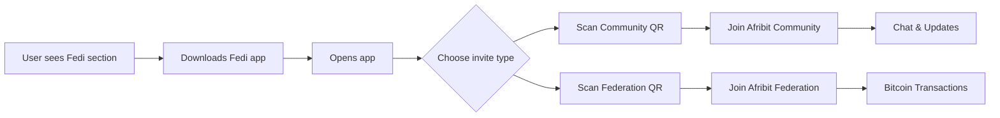

# Fedi Integration - Quick Reference

## For Team Members

### What is Fedi?
Fedi is a Bitcoin wallet with social features that allows communities to chat, transact, and connect. It uses the Fedimint protocol for shared custody and Lightning Network for instant payments.

### How to Access

1. **On Website:**
   - Navigate to "Community" in the header
   - Or visit: https://afribit.africa/fedi
   - Also featured prominently on homepage

2. **In Fedi App:**
   - Download from [App Store](https://apps.apple.com/app/fedi/id6444849426) or [Google Play](https://play.google.com/store/apps/details?id=com.fedi)
   - Scan QR codes on website to join

### User Onboarding Flow



### Two Types of Invites

#### Community Invite
- **Purpose:** Social features
- **Use For:** Chat, updates, announcements
- **Access:** Public discussions, group events
- **File:** `fedi-community-qr.png`

#### Federation Invite
- **Purpose:** Bitcoin transactions
- **Use For:** Sending/receiving Bitcoin, Lightning payments
- **Access:** Shared wallet custody, instant transactions
- **File:** `fedi-federation-qr.png`

### Managing Invites

#### If Codes Need to Change:

1. Update codes in `scripts/generate-qr-codes.js`:
```javascript
const COMMUNITY_INVITE = "fedi:community...";
const FEDERATION_INVITE = "fed11...";
```

2. Regenerate QR codes:
```bash
node scripts/generate-qr-codes.js
```

3. Rebuild and deploy:
```bash
npm run build
```

#### To Create New Invites:
- Use Fedi's Guardian Dashboard (if you're a guardian)
- Or use G-Bot service on Fedi
- Generate new invite links and update the script

### Content Management

#### Fedi Page (`/fedi`)
**File:** `app/fedi/page.tsx`

**Editable Sections:**
- Hero text and descriptions
- Feature highlights
- "Why Join" benefits
- Support contact email
- App download links

#### Homepage Section
**File:** `components/FediCommunity.tsx`

**Editable Sections:**
- Badge text ("New: We're on Fedi")
- Feature cards
- CTA button text
- Footer info

### Navigation Links

**Desktop Header:**
- Position: Between "Merchants" and "Contact"
- Label: "Community"
- Target: `/fedi`

**Mobile Bottom Bar:**
- Position: Middle (3rd of 5 items)
- Icon: FiHelpCircle (can be changed)
- Label: "Community"
- Target: `/fedi`

### Analytics to Track

1. **Page Views:**
   - `/fedi` page visits
   - Homepage Fedi section scrolls

2. **Engagement:**
   - QR code section views
   - Copy button clicks
   - External link clicks (app stores, fedi.xyz)

3. **Conversions:**
   - CTA button clicks
   - Deep link opens (if implemented)

### Troubleshooting

#### QR Codes Not Scanning?
1. Ensure codes haven't expired
2. Check image quality (should be 1024x1024px)
3. Test with Fedi app on different devices
4. Regenerate with higher error correction if needed

#### Page Not Loading?
1. Check build succeeded: `npm run build`
2. Clear Next.js cache: `rm -rf .next`
3. Check for TypeScript errors
4. Verify image paths are correct

#### Users Can't Join?
1. Verify invite codes are still valid
2. Check if federation/community still exists
3. Ensure users have latest Fedi app version
4. Test QR codes yourself first

### Best Practices

#### Community Management:
- Regular updates and announcements
- Respond to questions promptly
- Share impact stories and photos
- Recognize active members
- Host community events

#### Security:
- Never share guardian private keys
- Use 2FA on all guardian accounts
- Regularly backup federation data
- Monitor for suspicious activity
- Keep Fedi app updated

#### Engagement:
- Welcome new members personally
- Share behind-the-scenes content
- Ask for feedback and suggestions
- Celebrate milestones together
- Create exclusive community perks

### Resources

- **Fedi Support:** https://support.fedi.xyz/hc/en-us
- **Fedimint Docs:** https://fedimint.org/
- **Guardian Guide:** Check Fedi app for guardian resources
- **Community Best Practices:** Fedi Support Center

### Contact for Issues

- **Technical Issues:** connect@afribit.africa
- **Fedi Support:** support@fedi.xyz
- **Website Updates:** GitHub repository

---

**Last Updated:** January 2025
**Version:** 1.0
**Maintained By:** Afribit Africa Team
